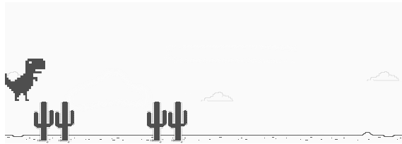

# Running Dinosaur Game

A simplified version of Google Chrome's browser game, created by Sebastien Gabriel, in which the player controls a running dinosaur and must press space in order to avoid the cacti that randomly appear.

This project was created as part of a bootcamp provided by [Digital Innovation One][dio], using JavaScript, CSS and HTML.

[dio]: <https://web.digitalinnovation.one/home>